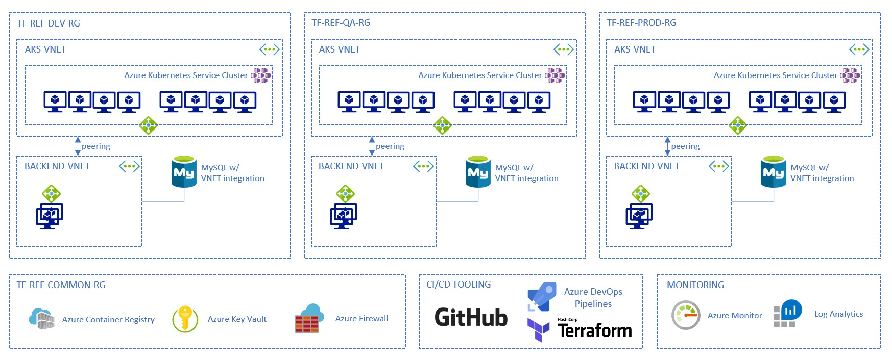

# Terraform on Azure Reference Architecture

This repository helps you to implement Infrastructure as Code best practices using Terraform and Microsoft Azure.

If you are not familiar with Infrastructure as Code (IaC), read [this page](https://docs.microsoft.com/en-us/azure/devops/learn/what-is-infrastructure-as-code) first.

## Overview of the architecture

*Note: in this example we don't pay attention as the application that is deployed itself as the focus is on deploying the infrastructure.*

This repository guides you in deploying the following architecture on Microsoft Azure, using [Terraform](https://www.terraform.io/intro/index.html).

There are 3 environments (Dev, QA and Prod). Each of the environment contains:
- An [Azure Kubernetes Service](https://docs.microsoft.com/en-us/azure/aks/intro-kubernetes) cluster, in its own virtual network
- Some load balancers
- A backend virtual network, that contains a [Virtual Machine Scale Set](https://docs.microsoft.com/en-us/azure/virtual-machine-scale-sets/overview) hosting a "legacy application"
- An [Azure Database for MySQL](https://docs.microsoft.com/en-us/azure/mysql/overview) service instance with [virtual network service endpoint](https://docs.microsoft.com/en-us/azure/mysql/concepts-data-access-and-security-vnet) so it can be reached by the legacy workloads and services running in AKS (Backend virtual network and AKS virtual network are peered together)

There are also common services used here:
- [Azure Container Registry](https://docs.microsoft.com/en-us/azure/container-registry/), to store the Docker image
- [Azure KeyVault](https://docs.microsoft.com/en-us/azure/key-vault/), to store the application secrets securely
- [Azure Firewall](https://docs.microsoft.com/en-us/azure/firewall/), to protect the application

We will also use [Azure Monitor](https://docs.microsoft.com/en-us/azure/azure-monitor/) with logs analytics to monitor all this infrastructure (and potentially the application).

Finally, all the infrastructure will be describe using Terraform HCL manifests stored in GitHub (this repository) and we will use [Azure DevOps Pipelines](https://docs.microsoft.com/en-us/azure/devops/pipelines/get-started/overview?view=azure-devops) to deploy all the infrastructure.

*Note: technically speaking, the pipeline that automates Terraform deployment can be hosted in any other CI/CD tool, like Jenkins, for example.*

As you can see, some parts of the infrastructure are specific for each environment, some other will be shared. This will help to illustrate how to handle deployments of different resources having different lifecycle.

## Prerequisites

In order to follow this documentation and try it by yourself, you need:

- A Microsoft Azure account. You can create a free trial account [here](https://azure.microsoft.com/en-us/free/).
- [Install Terraform](https://learn.hashicorp.com/terraform/getting-started/install.html) on your machine, if you want to experiment the scripts locally
- Fork this repository into your GitHub account
- An Azure DevOps organization. You can get started for free [here](https://azure.microsoft.com/en-us/services/devops/?nav=min) if you do not already use Azure DevOps

